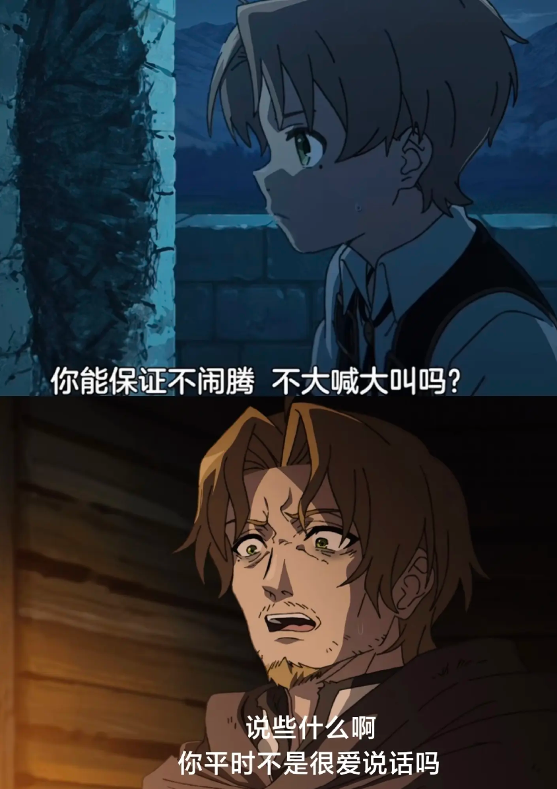
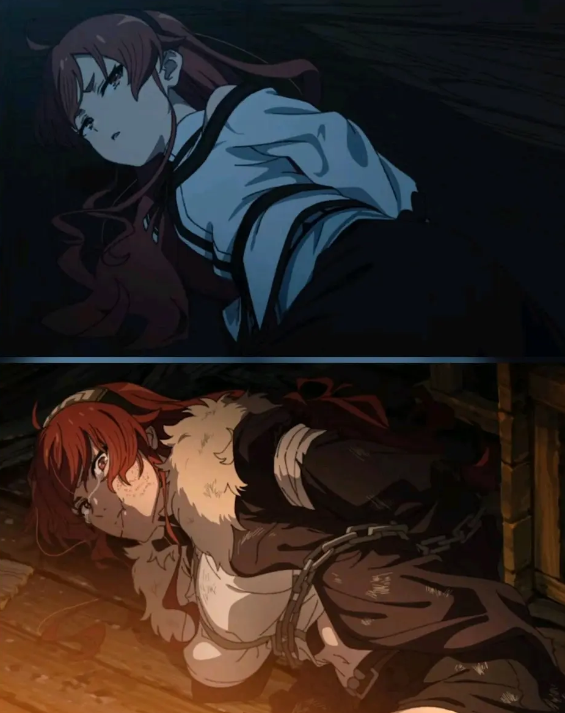

做为看过原作的小说党，首先是没想到把老鲁迪线给搬上来了，而且还只用一集的时间就大差不差的复现。

首先要狠狠夸赞一下制作组对于一些细节的把控以及原作者的callback能力。

'鲁迪，你不在的时候他们又朝我扔石头'

'不要大声叫喊，你能遵守这个约定吗？'

'大小姐她只是想要待在你的身边而已，她一直为了你努力着，她相信你总有一天会理解她 接受她，但是 你变了呢.....'

艾莉丝的回眸,真的我哭死

即使鲁迪变成人渣，对自己有着深刻的误会，甚至受到伤害

依旧能笑着面对鲁迪

动画组还有很多小巧思，比如在希露菲和洛琪希墓碑前所种植的花，杀害无辜的路人其实是当初帮助过鲁迪的人，诸如此类等等

甚至12集和13集老鲁迪的话还能分别接上形成对应

可见动画组是真的用心良苦，少经费大制作，情节虽然删减不少，但整体剧情连贯，观感氛围拉满

最后晚安！老鲁迪(;´Д`)

